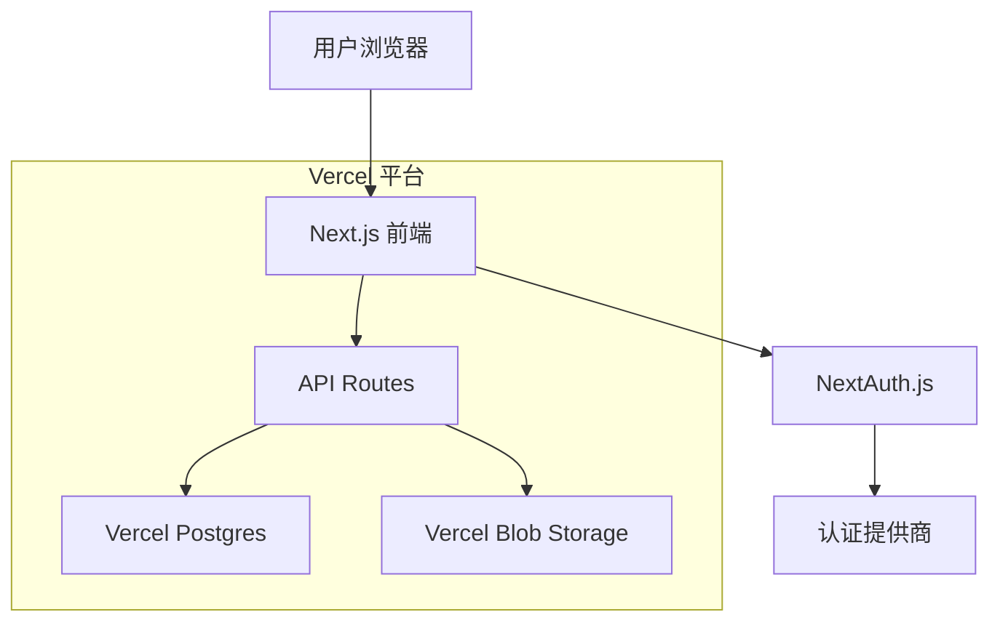

# 设计文档

## 概述

抖音直播互动软件官网是一个现代化的Web应用程序，采用Next.js 14 App Router架构，集成TailwindCSS进行样式设计，使用Vercel Postgres数据库存储数据，通过Zod进行数据验证，并部署在Vercel平台上。网站提供软件介绍、多平台下载、用户想法提交和用户认证功能。

## 架构

### 技术栈
- **前端框架**: Next.js 14 (App Router)
- **样式框架**: TailwindCSS 3.x
- **数据库**: Vercel Postgres
- **数据验证**: Zod
- **认证**: NextAuth.js
- **部署平台**: Vercel
- **文件存储**: Vercel Blob (用于安装包存储)

### 系统架构图



## 组件和接口

### 页面结构
```
/
├── page.tsx (首页 - 软件介绍)
├── download/
│   └── page.tsx (下载页面)
├── ideas/
│   ├── page.tsx (想法提交页面)
│   └── submit/
│       └── page.tsx (提交表单)
├── auth/
│   ├── signin/
│   │   └── page.tsx (登录页面)
│   └── signup/
│       └── page.tsx (注册页面)
├── dashboard/
│   └── page.tsx (用户仪表板)
└── admin/
    └── page.tsx (管理员面板)
```

### 核心组件

#### 1. 导航组件 (Navigation)
```typescript
interface NavigationProps {
  user?: User | null;
  className?: string;
}

// 功能：
// - 响应式导航菜单
// - 用户登录状态显示
// - 移动端汉堡菜单
```

#### 2. 软件展示组件 (SoftwareShowcase)
```typescript
interface SoftwareShowcaseProps {
  features: Feature[];
  screenshots: Screenshot[];
  demoVideo?: string;
}

// 功能：
// - 轮播图展示软件截图
// - 功能特点列表
// - 演示视频播放
// - 使用案例展示
```

#### 3. 下载组件 (DownloadSection)
```typescript
interface DownloadSectionProps {
  downloads: {
    windows: DownloadLink;
    macIntel: DownloadLink;
    macM1: DownloadLink;
  };
}

interface DownloadLink {
  version: string;
  size: string;
  url: string;
  checksum: string;
}

// 功能：
// - 自动检测用户操作系统
// - 显示对应的下载选项
// - 下载统计跟踪
// - 安装指导链接
```

#### 4. 想法提交组件 (IdeaSubmission)
```typescript
interface IdeaSubmissionProps {
  onSubmit: (idea: IdeaFormData) => Promise<void>;
  isAuthenticated: boolean;
}

interface IdeaFormData {
  title: string;
  description: string;
  category: string;
  contactEmail?: string;
}

// 功能：
// - 富文本编辑器
// - 分类选择
// - 文件附件上传
// - 表单验证
```

#### 5. 用户认证组件 (AuthForms)
```typescript
interface LoginFormProps {
  onSuccess: (user: User) => void;
  redirectTo?: string;
}

interface SignupFormProps {
  onSuccess: (user: User) => void;
}

// 功能：
// - 邮箱/密码登录
// - 社交登录选项
// - 表单验证
// - 错误处理
```

### API 接口设计

#### 1. 认证相关 API
```typescript
// POST /api/auth/register
interface RegisterRequest {
  email: string;
  password: string;
  name: string;
}

// POST /api/auth/login
interface LoginRequest {
  email: string;
  password: string;
}
```

#### 2. 想法提交 API
```typescript
// POST /api/ideas
interface CreateIdeaRequest {
  title: string;
  description: string;
  category: string;
  userId?: string;
}

// GET /api/ideas
interface GetIdeasResponse {
  ideas: Idea[];
  pagination: PaginationInfo;
}
```

#### 3. 下载统计 API
```typescript
// POST /api/downloads/track
interface TrackDownloadRequest {
  platform: 'windows' | 'mac-intel' | 'mac-m1';
  version: string;
  userAgent: string;
}

// GET /api/downloads/stats
interface DownloadStatsResponse {
  totalDownloads: number;
  platformBreakdown: Record<string, number>;
}
```

## 数据模型

### 数据库表结构

#### 1. Users 表
```sql
CREATE TABLE users (
  id SERIAL PRIMARY KEY,
  email VARCHAR(255) UNIQUE NOT NULL,
  name VARCHAR(255) NOT NULL,
  password_hash VARCHAR(255) NOT NULL,
  avatar_url VARCHAR(255),
  created_at TIMESTAMP DEFAULT NOW(),
  updated_at TIMESTAMP DEFAULT NOW()
);
```

#### 2. Ideas 表
```sql
CREATE TABLE ideas (
  id SERIAL PRIMARY KEY,
  title VARCHAR(255) NOT NULL,
  description TEXT NOT NULL,
  category VARCHAR(100) NOT NULL,
  status VARCHAR(50) DEFAULT 'pending',
  user_id INTEGER REFERENCES users(id),
  contact_email VARCHAR(255),
  created_at TIMESTAMP DEFAULT NOW(),
  updated_at TIMESTAMP DEFAULT NOW()
);
```

#### 3. Downloads 表
```sql
CREATE TABLE downloads (
  id SERIAL PRIMARY KEY,
  platform VARCHAR(50) NOT NULL,
  version VARCHAR(50) NOT NULL,
  user_agent TEXT,
  ip_address INET,
  user_id INTEGER REFERENCES users(id),
  created_at TIMESTAMP DEFAULT NOW()
);
```

#### 4. Software_Versions 表
```sql
CREATE TABLE software_versions (
  id SERIAL PRIMARY KEY,
  version VARCHAR(50) NOT NULL,
  platform VARCHAR(50) NOT NULL,
  download_url VARCHAR(500) NOT NULL,
  file_size BIGINT NOT NULL,
  checksum VARCHAR(255) NOT NULL,
  release_notes TEXT,
  is_active BOOLEAN DEFAULT true,
  created_at TIMESTAMP DEFAULT NOW()
);
```

### Zod 验证模式

```typescript
// 用户注册验证
export const registerSchema = z.object({
  email: z.string().email('请输入有效的邮箱地址'),
  password: z.string().min(8, '密码至少需要8个字符').regex(/^(?=.*[a-z])(?=.*[A-Z])(?=.*\d)/, '密码需要包含大小写字母和数字'),
  name: z.string().min(2, '姓名至少需要2个字符').max(50, '姓名不能超过50个字符'),
});

// 想法提交验证
export const ideaSchema = z.object({
  title: z.string().min(5, '标题至少需要5个字符').max(100, '标题不能超过100个字符'),
  description: z.string().min(20, '描述至少需要20个字符').max(2000, '描述不能超过2000个字符'),
  category: z.enum(['功能建议', '界面优化', '性能改进', '新功能', '其他']),
  contactEmail: z.string().email('请输入有效的邮箱地址').optional(),
});
```

## 错误处理

### 错误类型定义
```typescript
export enum ErrorCode {
  VALIDATION_ERROR = 'VALIDATION_ERROR',
  AUTHENTICATION_ERROR = 'AUTHENTICATION_ERROR',
  AUTHORIZATION_ERROR = 'AUTHORIZATION_ERROR',
  NOT_FOUND = 'NOT_FOUND',
  SERVER_ERROR = 'SERVER_ERROR',
  RATE_LIMIT_EXCEEDED = 'RATE_LIMIT_EXCEEDED',
}

export interface ApiError {
  code: ErrorCode;
  message: string;
  details?: Record<string, any>;
}
```

### 错误处理策略
1. **客户端错误处理**: 使用React Error Boundary捕获组件错误
2. **API错误处理**: 统一的错误响应格式和状态码
3. **表单验证错误**: 实时验证和友好的错误提示
4. **网络错误**: 自动重试机制和离线提示
5. **日志记录**: 使用Vercel Analytics记录错误日志

## 测试策略

### 测试层级
1. **单元测试**: 使用Jest和React Testing Library测试组件和工具函数
2. **集成测试**: 测试API路由和数据库交互
3. **端到端测试**: 使用Playwright测试关键用户流程
4. **性能测试**: 使用Lighthouse测试页面性能

### 测试覆盖范围
- 用户注册和登录流程
- 想法提交和管理
- 下载功能和统计
- 响应式设计
- 表单验证
- 错误处理

### 测试环境
- **开发环境**: 本地测试数据库
- **预发布环境**: Vercel Preview部署
- **生产环境**: 生产数据库的只读副本

## 性能优化

### 前端优化
1. **代码分割**: 使用Next.js动态导入进行路由级别的代码分割
2. **图片优化**: 使用Next.js Image组件进行自动优化
3. **缓存策略**: 实施适当的浏览器缓存和CDN缓存
4. **懒加载**: 对非关键组件实施懒加载

### 后端优化
1. **数据库索引**: 为常用查询字段添加索引
2. **查询优化**: 使用适当的SQL查询和连接
3. **缓存层**: 使用Redis缓存频繁访问的数据
4. **API限流**: 实施请求限流防止滥用

## 安全考虑

### 认证和授权
1. **密码安全**: 使用bcrypt进行密码哈希
2. **会话管理**: 使用NextAuth.js进行安全的会话管理
3. **CSRF保护**: 内置CSRF令牌验证
4. **XSS防护**: 输入验证和输出编码

### 数据保护
1. **输入验证**: 使用Zod进行严格的数据验证
2. **SQL注入防护**: 使用参数化查询
3. **敏感数据**: 加密存储敏感信息
4. **HTTPS**: 强制使用HTTPS连接

### 隐私保护
1. **数据最小化**: 只收集必要的用户数据
2. **数据保留**: 实施数据保留政策
3. **用户权利**: 提供数据导出和删除功能
4. **隐私政策**: 清晰的隐私政策和用户协议